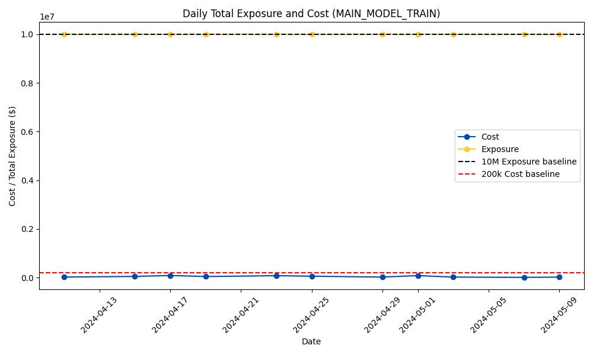
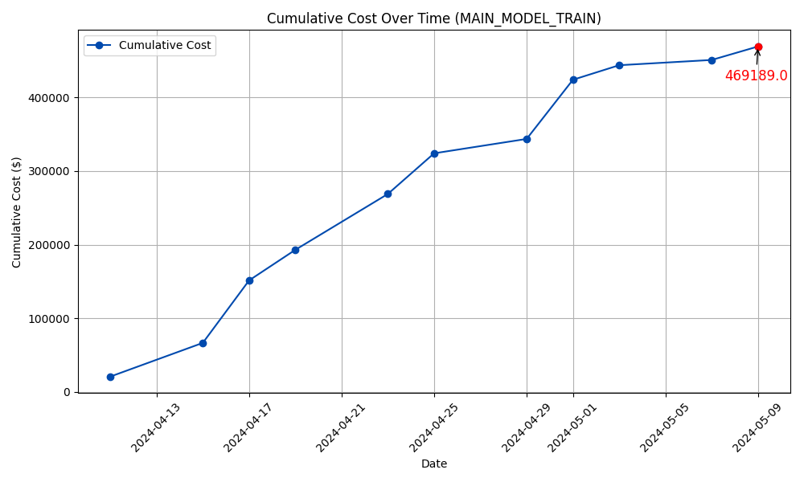

# Berkeley IEOR + Wells Fargo BADSS Case Competition: Optimizing Equity Derivative Hedging Strategies

## **Overview**
This project is a submission for the **Berkeley Algorithm Design & Systems Solutions (BADSS) Case Competition**, hosted by the **Berkeley IEOR Department** in collaboration with **Wells Fargo**. 

The competition focuses on **developing an optimization model** for **equity derivative hedging** under different market scenarios. Participants are provided with a dataset containing **call options** for **SPY (S&P 500), QQQ (Nasdaq 100), and IWM (Russell 2000)**. The goal is to design a trading strategy that:

- **Maintains a minimum exposure of +$10,000,000** under a specified market movement scenario.
- **Minimizes the total option premium cost** across the given timeframe.
- **Tracks daily exposure and profitability**, ensuring no negative exposure under any scenario.

---

## **Installation & Setup**
To run the model, we highly recommend you use a conda environment for replicability. Assuming you have `conda`, simply use the provided environment.yml file to get setup with the required dependencies:

- `conda env create -f environment.yml`

And activate the environment with:

- `conda activate badss`

Voila! You should be good to go.
---

## **Project Structure**
The key components of the project is structured as follows:

- `data` : contains raw training data and information pertaining to the competition
- `models` : contains `<model>.py` files for our approach towards the competition
- `notebooks` : contains jupyter notebooks used for exploratory data analysis and interpreting results
- `plots` : contains plot images for the given optimized trades
- `results` : contains `<optimized_trades>.csv` which refers to our models decisions and `<daily_spot_moves>.csv` which reflects the spot moves sampled from our predefined uniform distribution to simulate day by day variability

---
## **Running The Model and Getting The Results**
The simplest way to get started is to do the following:

1. Ensure `execute.sh` script has valid permissions, do: `chmod +x execute.sh`
2. Run `./execute.sh` 

---
## **Current Results**
The current working best performing model is the one that uses a Mixed Integer Linear Programming (MILP) approach to optimize for each day. You can find this model under `models/main_model.py`. At the end of the trading horizon, the MILP model achieved the following:

### Daily Total Exposure Maintained and Daily Cost Across Trading Horizon (TRAIN)

### Cumulative Cost Over Trading Horizon (TRAIN)

### Cumulative P&L Over Trading Horizon (TRAIN)

---

### Daily Total Exposure Maintained and Daily Cost Across Trading Horizon (TEST)

### Cumulative Cost Over Trading Horizon (TEST)

### Cumulative P&L Over Trading Horizon (TEST)

## **Team Acknowledgement & Results**
Our team’s MILP approach was recognized with 2nd place 🥈 out of 20 competing teams. We extend our gratitude to the UC Berkeley IEOR Department and Wells Fargo for providing this challenging opportunity to apply advanced optimization techniques to real-world financial problems.
